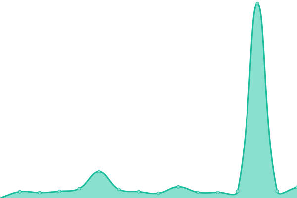
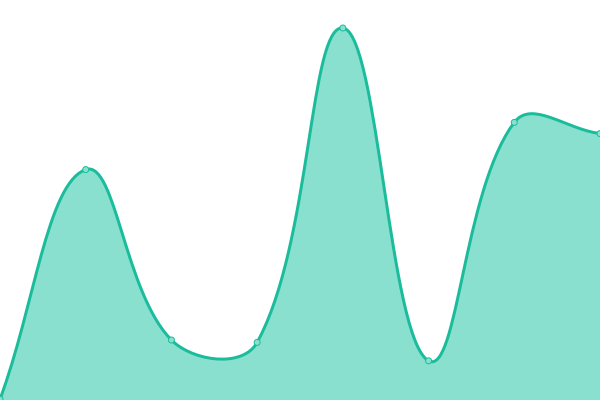

# [📈 Live Status](https://status.boundlesshosting.xyz): <!--live status--> **🟧 Partial outage**

This repository contains the open-source uptime monitor and status page for [Ryan Hindman](ryanhindman.top), powered by [Upptime](https://github.com/upptime/upptime).

With [Upptime](https://upptime.js.org), you can get your own unlimited and free uptime monitor and status page, powered entirely by a GitHub repository. We use [Issues](https://github.com/Ryanhindman6654/statsupagebh/issues) as incident reports, [Actions](https://github.com/Ryanhindman6654/statsupagebh/actions) as uptime monitors, and [Pages](https://status.boundlesshosting.xyz) for the status page.

<!--start: status pages-->
<!-- This summary is generated by Upptime (https://github.com/upptime/upptime) -->
<!-- Do not edit this manually, your changes will be overwritten -->
<!-- prettier-ignore -->
| URL | Status | History | Response Time | Uptime |
| --- | ------ | ------- | ------------- | ------ |
|  [Billing Site](https://boundlesshosting.xyz) | 🟩 Up | [billing-site.yml](https://github.com/Ryanhindman6654/statsupagebh/commits/HEAD/history/billing-site.yml) | 

 650ms
     
 | 

<a href="https://uptime.boundlesshosting.xyz/history/billing-site">100.00%</a>
    

|  [Game Panel](https://client.boundlesshosting.xyz) | 🟩 Up | [game-panel.yml](https://github.com/Ryanhindman6654/statsupagebh/commits/HEAD/history/game-panel.yml) | 

 165ms
     
 | 

<a href="https://uptime.boundlesshosting.xyz/history/game-panel">100.00%</a>
    

|  [VPS Node](https://vps.boundlesshosting.xyz) | 🟩 Up | [vps-node.yml](https://github.com/Ryanhindman6654/statsupagebh/commits/HEAD/history/vps-node.yml) | 

 202ms
     
 | 

<a href="https://uptime.boundlesshosting.xyz/history/vps-node">100.00%</a>
    

|  [Career Site](https://career.boundlesshosting.xyz) | 🟩 Up | [career-site.yml](https://github.com/Ryanhindman6654/statsupagebh/commits/HEAD/history/career-site.yml) | 

 187ms
     
 | 

<a href="https://uptime.boundlesshosting.xyz/history/career-site">100.00%</a>
    

|  [Tickets](https://tickets.boundlesshosting.xyz) | 🟩 Up | [tickets.yml](https://github.com/Ryanhindman6654/statsupagebh/commits/HEAD/history/tickets.yml) | 

 165ms
     
 | 

<a href="https://uptime.boundlesshosting.xyz/history/tickets">100.00%</a>
    

|  [Status](https://uptime.boundlesshosting.xyz) | 🟥 Down | [status.yml](https://github.com/Ryanhindman6654/statsupagebh/commits/HEAD/history/status.yml) | 

 854ms
     
 | 

<a href="https://uptime.boundlesshosting.xyz/history/status">100.00%</a>
    

<!--end: status pages-->

[**Visit our status website →**](https://status.boundlesshosting.xyz)

## 📄 License

- Powered by: [Upptime](https://github.com/upptime/upptime)
- Code: [MIT](./LICENSE) © [Anand Chowdhary](https://anandchowdhary.com), supported by [Pabio](https://pabio.com)
- Data in the `./history` directory: [Open Database License](https://opendatacommons.org/licenses/odbl/1-0/)
